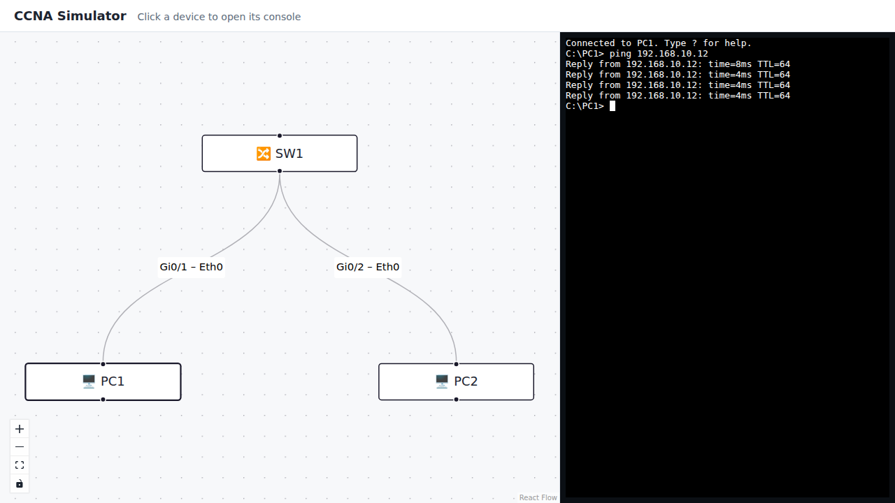

# CCNA Simulator

A browser-based network simulator for studying the Cisco CCNA 200-301 v2.0 exam. Build a topology, configure devices from an IOS-style command line, watch frames cross each link, and work through graded labs mapped to the exam blueprint.



## Status

Early skeleton. What works today:

- Topology canvas with switches and PCs (React Flow)
- IOS-style CLI in an xterm.js console: `enable`, `configure terminal`, `hostname`, `vlan`, `name`, `interface`, `switchport mode access|trunk`, `switchport access vlan`, trunk native/allowed VLANs, `shutdown`, `show vlan brief`, `show mac address-table`, `show interfaces trunk`, `show ip interface brief`, abbreviations (`sh vlan br`, `conf t`) and `?` help
- Switching engine: VLAN-aware MAC learning and flooding, 802.1Q trunks with native VLAN, MAC aging
- PCs with static IP, ARP and ping
- A frame trace of every hop, ready for the packet capture panel

See [docs/design.md](docs/design.md) for the full feature map and roadmap.

## Getting started

```bash
npm install
npm test          # engine unit tests (Vitest)
npm run dev       # web app at http://localhost:5173
npm run build     # static build in apps/web/dist
```

Requires Node 20 or newer.

## Layout

```
packages/engine   Simulation engine: pure TypeScript, no DOM, fully unit-tested
  src/core        addressing, frames, discrete-event scheduler, topology
  src/devices     Device base class, Switch, Pc (Router comes next)
  src/cli         IOS command parser and mode state machine
  test/           Vitest specs, written as small labs
apps/web          React + Vite front end: canvas, console, state store
labs/             Lab definitions (JSON), graded against engine state
docs/             Design doc and architecture notes
```

## How it works

Devices never call each other. A device hands a frame to the `Topology`, which schedules its delivery on a virtual clock (`Scheduler`). Running the simulation drains that queue in time order. This keeps every run deterministic, makes the engine easy to test, and lets the UI replay traffic one hop at a time.

## License

MIT
