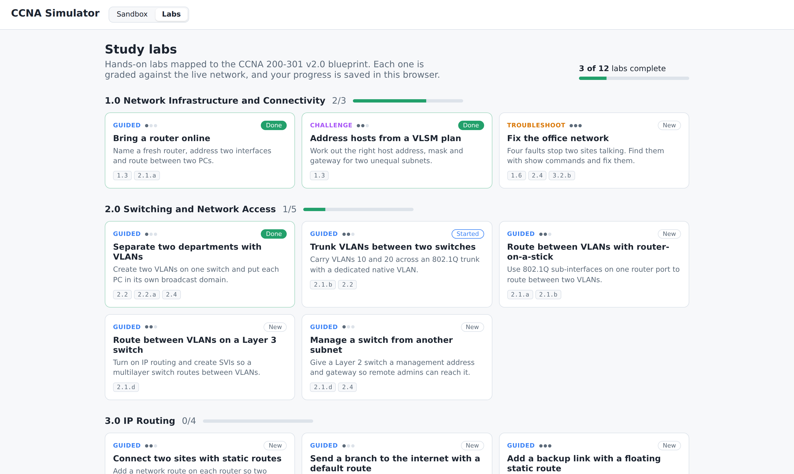
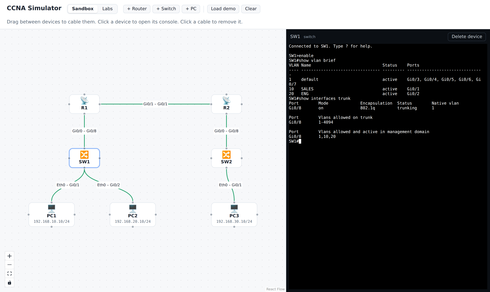
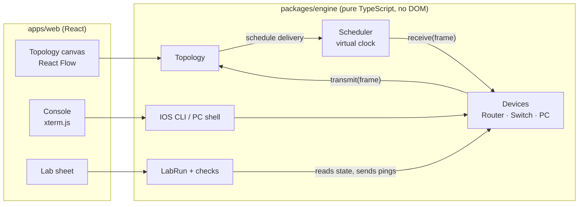

# CCNA Simulator

[](https://github.com/Onesayi/ccna-simulator/actions/workflows/ci.yml)
[](https://onesayi.github.io/ccna-simulator/)

[](LICENSE)

A browser-based network simulator for studying the Cisco CCNA 200-301 v2.0 exam. Build a topology, configure routers and switches from an IOS-style command line, and work through graded labs mapped to the exam blueprint. Everything runs client-side: no server, no install, no Cisco images.

**[Try the live demo →](https://onesayi.github.io/ccna-simulator/)**


## Try it in two minutes

1. Open the [live demo](https://onesayi.github.io/ccna-simulator/). A two-site network loads on the canvas.
2. Click **PC1** and run `ping 192.168.30.10`. The first ping loses a couple of packets while ARP resolves on each hop, just like real gear. Run `tracert 192.168.30.10` to see both routers.
3. Click **R1** and type `enable`, then `show ip route`, `sh ip int br` or `?` for help.
4. Open the **Labs** tab and pick [Bring a router online](https://onesayi.github.io/ccna-simulator/#/labs/router-basics). Objectives tick off as you type; press **Check my work** to run the ping tests.

## Features

### Study mode

The **Labs** tab has 12 hands-on labs mapped to the CCNA 200-301 v2.0 blueprint (domains 1.0 to 3.0): guided labs, troubleshooting labs with planted faults, and open-ended challenges.



- **Automatic checking.** Each objective is a check run against the live engine state: VLANs, access and trunk ports, sub-interfaces, SVIs, addresses, gateways, routes in the routing table, configured floating statics, and real pings and traceroutes. Configuration checks update as you type; traffic checks run when you press *Check my work*. A failed check says what it saw ("Gi0/1 is in VLAN 1"), not the answer.
- **Hints, quizzes and solutions.** Objectives carry optional hints, labs include multiple-choice questions on the theory behind them, and every lab has a model answer you can reveal.
- **Progress tracking.** Completion, checks and hints used are saved in your browser, and the catalog shows progress per blueprint domain.
- **Shareable links.** Each lab has its own URL, such as `#/labs/floating-static`.


<details>
<summary>All 12 labs</summary>

| Lab | Blueprint |
| --- | --- |
| Bring a router online | 1.3, 2.1.a |
| Address hosts from a VLSM plan | 1.3 |
| Separate two departments with VLANs | 2.2, 2.4 |
| Trunk VLANs between two switches | 2.1.b, 2.2 |
| Route between VLANs with router-on-a-stick | 2.1.a, 2.1.b |
| Route between VLANs on a Layer 3 switch | 2.1.d |
| Manage a switch from another subnet | 2.1.d, 2.4 |
| Connect two sites with static routes | 3.1, 3.2.b |
| Send a branch to the internet with a default route | 3.1, 3.2.a |
| Add a backup link with a floating static route | 3.2.b, 3.2.c, 3.2.d |
| Fix the office network (troubleshooting) | 1.6, 2.4, 3.2.b |
| Capstone: build two sites from scratch | 2.1, 2.2, 3.2.b |

</details>

### Simulation engine



- **Topology canvas**: add routers, switches and PCs, drag between devices to cable them, click a cable to remove it. Cables turn red and dashed while either end is down. A demo network (two sites, router-on-a-stick, static routes) loads on start.
- **Routers**: GigabitEthernet ports that start shut down (a link only comes up when both ends are enabled), loopbacks, 802.1Q sub-interfaces for router-on-a-stick, connected and local routes, static routes by next hop and/or exit interface, default routes, floating statics (administrative distance), proxy ARP, TTL expiry and ICMP unreachables.
- **Switches**: VLAN-aware MAC learning and flooding, 802.1Q trunks with native and allowed VLANs, MAC aging, SVIs with autostate, `ip default-gateway`, and inter-VLAN routing with `ip routing`.
- **PCs**: a Packet Tracer style command prompt with `ipconfig`, `ping [-n count]`, `tracert` and `arp -a`.
- **IOS CLI**: mode hierarchy with abbreviations (`conf t`, `sh ip int br`), `?` help, `do` from config mode, `interface`, `ip address`, `encapsulation dot1q`, `ip route`, `ip routing`, VLAN and switchport commands, `ping`, `traceroute`, and `show running-config`, `ip route`, `ip arp`, `ip interface brief`, `vlan brief`, `mac address-table`, `interfaces trunk`, `interfaces <if> switchport`. Output follows real IOS formatting, including the `.!!!!` first ping while ARP resolves.
- A frame trace of every hop, ready for the packet capture panel.

See [docs/design.md](docs/design.md) for the full feature map and roadmap.

## How it works



Devices never call each other. A device hands a frame to the `Topology`, which schedules its delivery on a virtual clock (`Scheduler`). Running the simulation drains that queue in time order. That keeps every run deterministic, makes the engine easy to test without a browser, and lets the UI replay traffic one hop at a time.

The engine is a separate package with no DOM or React imports, so the same code runs in the browser, in Vitest, and in the lab grader. The grader is mostly pure reads of engine state; only ping and traceroute checks send traffic.

Some decisions worth calling out:

- **Real IOS behaviour over shortcuts.** Router ports start shut down, links need both ends enabled, the first ping shows `.!!!!` while ARP resolves, SVIs follow autostate, and output follows real `show` formatting so study notes and simulator output match.
- **Labs graded by state, not by keystrokes.** Any valid configuration that produces the right network passes, so learners can use abbreviations, different orders, or alternative solutions.
- **Every lab is proven solvable.** The test suite types each lab's model answer through the real CLI and requires every objective to pass, so a broken lab fails CI.

## Testing

| Layer | Tool | What it covers |
| --- | --- | --- |
| Engine | Vitest | 100+ specs written as small labs: switching, trunks, routing, the IOS CLI, the PC prompt, the scheduler, and every lab in the catalog. Coverage is enforced in CI (98% of lines). |
| App | Playwright | The production build in Chromium: the demo network, pinging across routers, the IOS console, adding and deleting devices, completing a lab end to end, hints, solutions and deep links. |

```bash
npm test              # engine unit tests
npm run coverage      # unit tests with a coverage report (fails under the thresholds)
npm run test:e2e      # build the app and run the Playwright suite
npm run screenshots -w @ccna-sim/web   # regenerate the README images and walkthrough GIF
```

CI runs typecheck, unit tests with coverage, the build and the end-to-end suite on every pull request, and deploys `main` to GitHub Pages.

## Getting started

```bash
npm install
npm run dev           # web app at http://localhost:5173
npm run build         # static build in apps/web/dist
```

Requires Node 20 or newer. The first `npm run test:e2e` needs a browser: `npx playwright install chromium`.

## Layout

```
packages/engine   Simulation engine: pure TypeScript, no DOM, fully unit-tested
  src/core        addressing, frames, discrete-event scheduler, topology
  src/devices     Device base class, IpDevice (shared IPv4 stack), Router, Switch, Pc
  src/cli         IOS command parser, show output formatters, PC command prompt
  src/labs        Lab format, grader checks, LabRun, progress tracking, and the lab catalog
  test/           Vitest specs, written as small labs
apps/web          React + Vite front end: canvas, console, lab catalog and lab sheet, state stores
  e2e/            Playwright specs and the screenshot generator
docs/             Design doc, architecture notes and README images
```

## Writing a lab

Labs live in `packages/engine/src/labs/catalog/` as typed objects: a briefing, a starting topology (devices, cables, and IOS commands to pre-configure them), objectives, and a model answer per device. Each objective pairs a sentence with a check, for example:

```ts
{ text: 'SW1 Gi0/8 trunks VLANs 10, 20, 99 with native VLAN 99',
  check: { type: 'trunk', device: 'SW1', interface: 'Gi0/8', nativeVlan: 99, allowed: [10, 20, 99] },
  hint: 'Verify with `show interfaces trunk`.' }
```

Add the lab's id to the order in `catalog/index.ts` and `npm test` will prove it can be solved.

## Roadmap

Next up are the protocols behind blueprint domains 4.0 and 5.0, so labs can cover them too: IPv6, DHCP, Rapid PVST+, OSPF, FHRP, NAT, ACLs, port security and DHCP snooping. See [docs/design.md](docs/design.md).

## License

MIT
