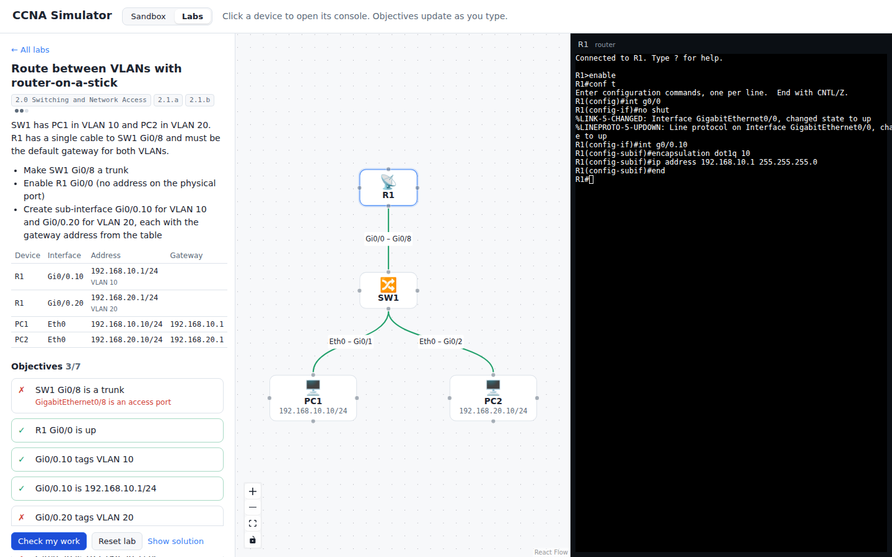

# CCNA Simulator

A browser-based network simulator for studying the Cisco CCNA 200-301 v2.0 exam. Build a topology, configure devices from an IOS-style command line, watch frames cross each link, and work through graded labs mapped to the exam blueprint.


## Status

Phase 1 (core engine) and Phase 2 (study mode) are in.

### Study mode

The **Labs** tab has 12 hands-on labs mapped to the CCNA 200-301 v2.0 blueprint (domains 1.0 to 3.0): guided labs, troubleshooting labs with planted faults, and open-ended challenges.



- **Automatic checking.** Each objective is a check run against the live engine state: VLANs, access and trunk ports, sub-interfaces, SVIs, addresses, gateways, routes in the routing table, configured floating statics, and real pings and traceroutes. Configuration checks update as you type; traffic checks run when you press *Check my work*. A failed check says what it saw ("Gi0/1 is in VLAN 1"), not the answer.
- **Hints, quizzes and solutions.** Objectives carry optional hints, labs include multiple-choice questions on the theory behind them, and every lab has a model answer you can reveal.
- **Progress tracking.** Completion, checks and hints used are saved in your browser, and the catalog shows progress per blueprint domain.
- **Shareable links.** Each lab has its own URL, such as `#/labs/floating-static`.
- Every lab is tested: the suite builds each lab, confirms it starts unsolved, types in its model answer through the real CLI, and requires every objective to pass.

| Lab | Blueprint |
| --- | --- |
| Bring a router online | 1.3, 2.1.a |
| Address hosts from a VLSM plan | 1.3 |
| Separate two departments with VLANs | 2.2, 2.4 |
| Trunk VLANs between two switches | 2.1.b, 2.2 |
| Route between VLANs with router-on-a-stick | 2.1.a, 2.1.b |
| Route between VLANs on a Layer 3 switch | 2.1.d |
| Manage a switch from another subnet | 2.1.d, 2.4 |
| Connect two sites with static routes | 3.1, 3.2.b |
| Send a branch to the internet with a default route | 3.1, 3.2.a |
| Add a backup link with a floating static route | 3.2.b, 3.2.c, 3.2.d |
| Fix the office network (troubleshooting) | 1.6, 2.4, 3.2.b |
| Capstone: build two sites from scratch | 2.1, 2.2, 3.2.b |

### Engine

- **Topology canvas**: add routers, switches and PCs, drag between devices to cable them, click a cable to remove it. Cables turn red and dashed while either end is down. A demo network (two sites, router-on-a-stick, static routes) loads on start.
- **Routers**: GigabitEthernet ports that start shut down (a link only comes up when both ends are enabled), loopbacks, 802.1Q sub-interfaces for router-on-a-stick, connected and local routes, static routes by next hop and/or exit interface, default routes, floating statics (administrative distance), proxy ARP, TTL expiry and ICMP unreachables.
- **Switches**: VLAN-aware MAC learning and flooding, 802.1Q trunks with native and allowed VLANs, MAC aging, SVIs with autostate, `ip default-gateway`, and inter-VLAN routing with `ip routing`.
- **PCs**: a Packet Tracer style command prompt with `ipconfig`, `ping [-n count]`, `tracert` and `arp -a`.
- **IOS CLI**: mode hierarchy with abbreviations (`conf t`, `sh ip int br`), `?` help, `do` from config mode, `interface`, `ip address`, `encapsulation dot1q`, `ip route`, `ip routing`, VLAN and switchport commands, `ping`, `traceroute`, and `show running-config`, `ip route`, `ip arp`, `ip interface brief`, `vlan brief`, `mac address-table`, `interfaces trunk`, `interfaces <if> switchport`. Output follows real IOS formatting, including the `.!!!!` first ping while ARP resolves.
- A frame trace of every hop, ready for the packet capture panel.

See [docs/design.md](docs/design.md) for the full feature map and roadmap.

## Getting started

```bash
npm install
npm test          # engine unit tests (Vitest)
npm run dev       # web app at http://localhost:5173
npm run build     # static build in apps/web/dist
```

Requires Node 20 or newer.

## Layout

```
packages/engine   Simulation engine: pure TypeScript, no DOM, fully unit-tested
  src/core        addressing, frames, discrete-event scheduler, topology
  src/devices     Device base class, IpDevice (shared IPv4 stack), Router, Switch, Pc
  src/cli         IOS command parser, show output formatters, PC command prompt
  src/labs        Lab format, grader checks, LabRun, progress tracking, and the lab catalog
  test/           Vitest specs, written as small labs
apps/web          React + Vite front end: canvas, console, lab catalog and lab sheet, state stores
docs/             Design doc and architecture notes
```

## Writing a lab

Labs live in `packages/engine/src/labs/catalog/` as typed objects: a briefing, a starting topology (devices, cables, and IOS commands to pre-configure them), objectives, and a model answer per device. Each objective pairs a sentence with a check, for example:

```ts
{ text: 'SW1 Gi0/8 trunks VLANs 10, 20, 99 with native VLAN 99',
  check: { type: 'trunk', device: 'SW1', interface: 'Gi0/8', nativeVlan: 99, allowed: [10, 20, 99] },
  hint: 'Verify with `show interfaces trunk`.' }
```

Add the lab's id to the order in `catalog/index.ts` and `npm test` will prove it can be solved.

## How it works

Devices never call each other. A device hands a frame to the `Topology`, which schedules its delivery on a virtual clock (`Scheduler`). Running the simulation drains that queue in time order. This keeps every run deterministic, makes the engine easy to test, and lets the UI replay traffic one hop at a time.

## License

MIT
